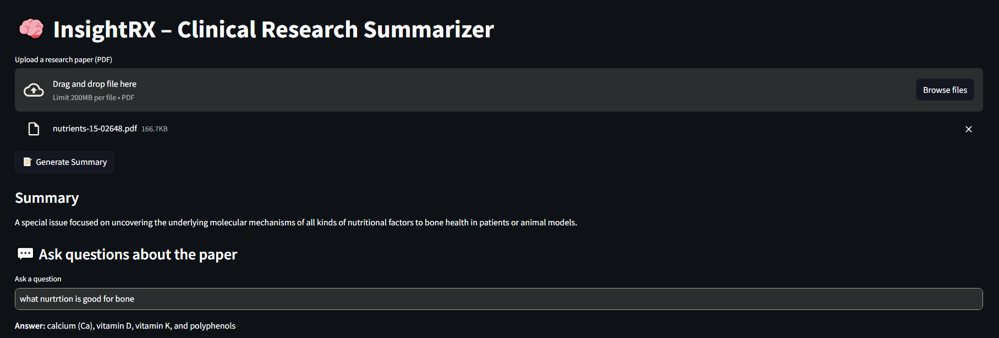

# InsightRX – Clinical Research Summarizer

**InsightRX** is a Streamlit-based web application designed to assist researchers and clinicians by summarizing clinical research papers and providing a question-answering (Q&A) interface to extract specific information from the papers. The app uses natural language processing (NLP) models to generate concise summaries and answer user queries, making it easier to quickly understand and analyze research content.



## Features

- **PDF Upload:** Upload clinical research papers in PDF format.
- **Summarization:** Generate concise summaries of the uploaded papers, focusing on key findings and arguments.
- **Question Answering:** Ask specific questions about the paper, and get answers based on the content.
- **Persistent Interface:** The summary and chat history persist across interactions, allowing users to refer to the summary while asking questions.
- **Local Model Execution:** Uses the `t5-small` model from Hugging Face for summarization and Q&A, running locally to avoid API dependency issues.

## Tech Stack

- **Streamlit:** For the web interface.
- **Transformers (Hugging Face):** For NLP tasks (summarization and Q&A) using the `t5-small` model.
- **LangChain:** For building the Retrieval-Augmented Generation (RAG) pipeline for Q&A.
- **PyTorch:** For running the NLP models.
- **Sentence Transformers:** For generating embeddings for the RAG pipeline.
- **Python:** Core programming language.

## Prerequisites

Before running the project locally, ensure you have the following installed:

- Python 3.8 or higher
- Git
- A virtual environment tool (e.g., `venv`)

## Installation

1. **Clone the Repository:**
   ```bash
   git clone https://github.com/tonylai2022/InsightRX.git
   cd InsightRX
   ```

2. **Set Up a Virtual Environment:**
   ```bash
   python -m venv env
   source env/bin/activate  # On Windows: env\Scripts\activate
   ```

3. **Install Dependencies:**
   ```bash
   pip install -r requirements.txt
   ```

4. **Set Up Environment Variables:**
   - Create a `.env` file in the project root directory.
   - Add your Hugging Face API token:
     ```
     HUGGINGFACEHUB_API_TOKEN=your_huggingface_api_token
     ```

## Usage

1. **Run the Application:**
   ```bash
   streamlit run app.py
   ```

2. **Upload a PDF:**
   - Use the file uploader in the web interface to upload a clinical research paper in PDF format.

3. **Generate a Summary:**
   - Click the "📝 Generate Summary" button to generate a concise summary of the uploaded paper.

4. **Ask Questions:**
   - Use the text input box to ask specific questions about the paper. The app will provide answers based on the content.

## Troubleshooting

- **Missing Hugging Face Token:**
  - Ensure the `HUGGINGFACEHUB_API_TOKEN` is correctly set in the `.env` file.

- **Dependency Issues:**
  - Ensure all dependencies are installed by running:
    ```bash
    pip install -r requirements.txt
    ```

- **Runtime Errors:**
  - If you encounter `RuntimeError: no running event loop`, ensure you are using Python 3.8 or higher and that the `asyncio` library is properly installed.

- **PDF Parsing Errors:**
  - Ensure the uploaded PDF is not corrupted and contains selectable text.

## License

This project is licensed under the MIT License. 

## Acknowledgments

- Hugging Face for providing pre-trained NLP models.
- Streamlit for the easy-to-use web app framework.
- LangChain for enabling the RAG pipeline.
- Sentence Transformers for embedding generation.

---
